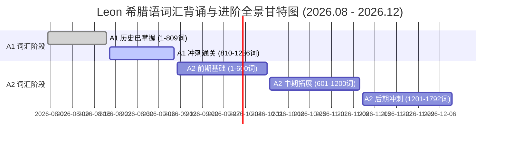

# Leon 希腊语 A1 - A2 进阶词汇全景背诵与艾宾浩斯复习总览

> **学习者**：Leon (10 岁)
> **全量词汇库**：希腊语 A1 儿童版 (1,236 词) + 希腊语 A2 青少年进阶版 (1,792 词)
> **双阶段总词汇量**：**3,028 词**
> **当前进度基准 (2026-08-20)**：A1 已背至 **#809 「παλάτι, το」[宫殿]**（已掌握 809 词）
> **推进速率**：稳定保持 **+20 词 / 天**
> **两阶段推进节点**：
> - **阶段一 (A1 冲刺)**：2026-08-21 ~ 2026-09-11（用时 22 天，完成 A1 全量 1,236 词）
> - **阶段二 (A2 进阶)**：2026-09-12 ~ 2026-12-10（用时 90 天，完成 A2 全量 1,792 词）
> - **总里程碑**：共计 112 天，**2026年12月10日** 达成 A1 + A2 **3,028 词大满贯！**
> **复习模型**：艾宾浩斯记忆曲线 (+1d, +2d, +4d, +7d, +15d, +30d) + 历史掌握词库循环滚动轮巡

---

## 📈 一、全阶段学习进度全景图 (Progress Roadmap)

---

## 📊 二、全阶段 112 天每日推进计划总表 (Daily Master Matrix)

| 阶段 | 学习日 | 日期 | 当日新学目标 | 范围编号 | 当日进度 | 累计总词数 | 艾宾浩斯复习节点 | 状态 |
| :--- | :--- | :--- | :--- | :--- | :--- | :--- | :--- | :--- |
| **基准** | **基准日** | **2026-08-20** | **A1 历史已学** | **A1 #1 ~ #809** | **809 / 1236** | **809 / 3028** | **截止「παλάτι 宫殿」** | **[√] 已达成** |
| A1 | Day 001 | 2026-08-21 | πάλι ~ παρακαλώ | A1 #810 ~ #829 (20词) | A1 冲刺阶段 (829/1236) | 829 / 3028 | 首日免复习 | ⏳ 计划中 |
| A1 | Day 002 | 2026-08-22 | παρακάτω ~ Πειραιάς, ο | A1 #830 ~ #849 (20词) | A1 冲刺阶段 (849/1236) | 849 / 3028 | +1d (D1: A1 #810-829) | ⏳ 计划中 |
| A1 | Day 003 | 2026-08-23 | πειρατής, ο ~ πηγαίνω | A1 #850 ~ #869 (20词) | A1 冲刺阶段 (869/1236) | 869 / 3028 | +1d (D2: A1 #830-849) +2d (D1: A1 #810-829) | ⏳ 计划中 |
| A1 | Day 004 | 2026-08-24 | Πήγασος, ο ~ πλατσουρίζω | A1 #870 ~ #889 (20词) | A1 冲刺阶段 (889/1236) | 889 / 3028 | +1d (D3: A1 #850-869) +2d (D2: A1 #830-849) | ⏳ 计划中 |
| A1 | Day 005 | 2026-08-25 | πλένω ~ ποντίκι, το | A1 #890 ~ #909 (20词) | A1 冲刺阶段 (909/1236) | 909 / 3028 | +1d (D4: A1 #870-889) +2d (D3: A1 #850-869) +4d (D1: A1 #810-829) | ⏳ 计划中 |
| A1 | Day 006 | 2026-08-26 | ποντίκια, τα ~ πρόβατο, το | A1 #910 ~ #929 (20词) | A1 冲刺阶段 (929/1236) | 929 / 3028 | +1d (D5: A1 #890-909) +2d (D4: A1 #870-889) +4d (D2: A1 #830-849) | ⏳ 计划中 |
| A1 | Day 007 | 2026-08-27 | πρόβλημα, το ~ ράφι, το | A1 #930 ~ #949 (20词) | A1 冲刺阶段 (949/1236) | 949 / 3028 | +1d (D6: A1 #910-929) +2d (D5: A1 #890-909) +4d (D3: A1 #850-869) | ⏳ 计划中 |
| A1 | Day 008 | 2026-08-28 | Ρέα, η ~ σαμπουάν, το | A1 #950 ~ #969 (20词) | A1 冲刺阶段 (969/1236) | 969 / 3028 | +1d (D7: A1 #930-949) +2d (D6: A1 #910-929) +4d (D4: A1 #870-889) +7d (D1: A1 #810-829) | ⏳ 计划中 |
| A1 | Day 009 | 2026-08-29 | σάντουιτς, το ~ σκάλες, οι | A1 #970 ~ #989 (20词) | A1 冲刺阶段 (989/1236) | 989 / 3028 | +1d (D8: A1 #950-969) +2d (D7: A1 #930-949) +4d (D5: A1 #890-909) +7d (D2: A1 #830-849) | ⏳ 计划中 |
| A1 | Day 010 | 2026-08-30 | σκέφτομαι ~ σοφός, -ή, -ό | A1 #990 ~ #1009 (20词) | A1 冲刺阶段 (1009/1236) | 1009 / 3028 | +1d (D9: A1 #970-989) +2d (D8: A1 #950-969) +4d (D6: A1 #910-929) +7d (D3: A1 #850-869) | ⏳ 计划中 |
| A1 | Day 011 | 2026-08-31 | σπαζοκεφαλιά, η ~ συγκρίνω | A1 #1010 ~ #1029 (20词) | A1 冲刺阶段 (1029/1236) | 1029 / 3028 | +1d (D10: A1 #990-1009) +2d (D9: A1 #970-989) +4d (D7: A1 #930-949) +7d (D4: A1 #870-889) | ⏳ 计划中 |
| A1 | Day 012 | 2026-09-01 | συζητάω (-ώ) ~ Σωτηρία, η | A1 #1030 ~ #1049 (20词) | A1 冲刺阶段 (1049/1236) | 1049 / 3028 | +1d (D11: A1 #1010-1029) +2d (D10: A1 #990-1009) +4d (D8: A1 #950-969) +7d (D5: A1 #890-909) | ⏳ 计划中 |
| A1 | Day 013 | 2026-09-02 | ταβέρνα, η ~ τέσσερις, -α | A1 #1050 ~ #1069 (20词) | A1 冲刺阶段 (1069/1236) | 1069 / 3028 | +1d (D12: A1 #1030-1049) +2d (D11: A1 #1010-1029) +4d (D9: A1 #970-989) +7d (D6: A1 #910-929) | ⏳ 计划中 |
| A1 | Day 014 | 2026-09-03 | Τετάρτη, η ~ τραγουδάω (-ώ) | A1 #1070 ~ #1089 (20词) | A1 冲刺阶段 (1089/1236) | 1089 / 3028 | +1d (D13: A1 #1050-1069) +2d (D12: A1 #1030-1049) +4d (D10: A1 #990-1009) +7d (D7: A1 #930-949) | ⏳ 计划中 |
| A1 | Day 015 | 2026-09-04 | τραγούδι, το ~ τσουλήθρα, η | A1 #1090 ~ #1109 (20词) | A1 冲刺阶段 (1109/1236) | 1109 / 3028 | +1d (D14: A1 #1070-1089) +2d (D13: A1 #1050-1069) +4d (D11: A1 #1010-1029) +7d (D8: A1 #950-969) | ⏳ 计划中 |
| A1 | Day 016 | 2026-09-05 | τύμπανο, το ~ Φανή, η | A1 #1110 ~ #1129 (20词) | A1 冲刺阶段 (1129/1236) | 1129 / 3028 | +1d (D15: A1 #1090-1109) +2d (D14: A1 #1070-1089) +4d (D12: A1 #1030-1049) +7d (D9: A1 #970-989) +15d (D1: A1 #810-829) | ⏳ 计划中 |
| A1 | Day 017 | 2026-09-06 | Φάνης, ο ~ φούστα, η | A1 #1130 ~ #1149 (20词) | A1 冲刺阶段 (1149/1236) | 1149 / 3028 | +1d (D16: A1 #1110-1129) +2d (D15: A1 #1090-1109) +4d (D13: A1 #1050-1069) +7d (D10: A1 #990-1009) +15d (D2: A1 #830-849) | ⏳ 计划中 |
| A1 | Day 018 | 2026-09-07 | φράουλα, η ~ χαλί, το | A1 #1150 ~ #1169 (20词) | A1 冲刺阶段 (1169/1236) | 1169 / 3028 | +1d (D17: A1 #1130-1149) +2d (D16: A1 #1110-1129) +4d (D14: A1 #1070-1089) +7d (D11: A1 #1010-1029) +15d (D3: A1 #850-869) | ⏳ 计划中 |
| A1 | Day 019 | 2026-09-08 | χαμηλός, -ή, -ό ~ χιονοπόλεμος, ο | A1 #1170 ~ #1189 (20词) | A1 冲刺阶段 (1189/1236) | 1189 / 3028 | +1d (D18: A1 #1150-1169) +2d (D17: A1 #1130-1149) +4d (D15: A1 #1090-1109) +7d (D12: A1 #1030-1049) +15d (D4: A1 #870-889) | ⏳ 计划中 |
| A1 | Day 020 | 2026-09-09 | χολ, το ~ χυμός, ο | A1 #1190 ~ #1209 (20词) | A1 冲刺阶段 (1209/1236) | 1209 / 3028 | +1d (D19: A1 #1170-1189) +2d (D18: A1 #1150-1169) +4d (D16: A1 #1110-1129) +7d (D13: A1 #1050-1069) +15d (D5: A1 #890-909) | ⏳ 计划中 |
| A1 | Day 021 | 2026-09-10 | χώμα, το ~ ώστε | A1 #1210 ~ #1229 (20词) | A1 冲刺阶段 (1229/1236) | 1229 / 3028 | +1d (D20: A1 #1190-1209) +2d (D19: A1 #1170-1189) +4d (D17: A1 #1130-1149) +7d (D14: A1 #1070-1089) +15d (D6: A1 #910-929) | ⏳ 计划中 |
| A1 | Day 022 | 2026-09-11 | ωστόσο ~ (ε)πάνω σε | A1 #1230 ~ #1236 (7词) | A1 冲刺阶段 (1236/1236) | 1236 / 3028 | +1d (D21: A1 #1210-1229) +2d (D20: A1 #1190-1209) +4d (D18: A1 #1150-1169) +7d (D15: A1 #1090-1109) +15d (D7: A1 #930-949) | 🎉 A1 通关！ |
| A2 | Day 023 | 2026-09-12 | αβγό, το ~ αέρας, ο | A2 #1 ~ #20 (20词) | A2 进阶阶段 (20/1792) | 1256 / 3028 | +1d (D22: A1 #1230-1236) +2d (D21: A1 #1210-1229) +4d (D19: A1 #1170-1189) +7d (D16: A1 #1110-1129) +15d (D8: A1 #950-969) | ⏳ 计划中 |
| A2 | Day 024 | 2026-09-13 | αίθουσα, η ~ ανάμεσα | A2 #21 ~ #40 (20词) | A2 进阶阶段 (40/1792) | 1276 / 3028 | +1d (D23: A2 #1-20) +2d (D22: A1 #1230-1236) +4d (D20: A1 #1190-1209) +7d (D17: A1 #1130-1149) +15d (D9: A1 #970-989) | ⏳ 计划中 |
| A2 | Day 025 | 2026-09-14 | αναπαύομαι ~ αξιόπιστος, -η, -ο | A2 #41 ~ #60 (20词) | A2 进阶阶段 (60/1792) | 1296 / 3028 | +1d (D24: A2 #21-40) +2d (D23: A2 #1-20) +4d (D21: A1 #1210-1229) +7d (D18: A1 #1150-1169) +15d (D10: A1 #990-1009) | ⏳ 计划中 |
| A2 | Day 026 | 2026-09-15 | αξιωματικός, ο ~ απορώ | A2 #61 ~ #80 (20词) | A2 进阶阶段 (80/1792) | 1316 / 3028 | +1d (D25: A2 #41-60) +2d (D24: A2 #21-40) +4d (D22: A1 #1230-1236) +7d (D19: A1 #1170-1189) +15d (D11: A1 #1010-1029) | ⏳ 计划中 |
| A2 | Day 027 | 2026-09-16 | αποσπώ ~ αγορά, η | A2 #81 ~ #100 (20词) | A2 进阶阶段 (100/1792) | 1336 / 3028 | +1d (D26: A2 #61-80) +2d (D25: A2 #41-60) +4d (D23: A2 #1-20) +7d (D20: A1 #1190-1209) +15d (D12: A1 #1030-1049) | ⏳ 计划中 |
| A2 | Day 028 | 2026-09-17 | αγοράζω ~ αθλητικ-ός, -ή, -ό | A2 #101 ~ #120 (20词) | A2 进阶阶段 (120/1792) | 1356 / 3028 | +1d (D27: A2 #81-100) +2d (D26: A2 #61-80) +4d (D24: A2 #21-40) +7d (D21: A1 #1210-1229) +15d (D13: A1 #1050-1069) | ⏳ 计划中 |
| A2 | Day 029 | 2026-09-18 | αθλητικά γεγονότα, τα ~ Αλέξανδρος, ο | A2 #121 ~ #140 (20词) | A2 进阶阶段 (140/1792) | 1376 / 3028 | +1d (D28: A2 #101-120) +2d (D27: A2 #81-100) +4d (D25: A2 #41-60) +7d (D22: A1 #1230-1236) +15d (D14: A1 #1070-1089) | ⏳ 计划中 |
| A2 | Day 030 | 2026-09-19 | Αλέξανδρος, ο Μέγας ~ ανακατεύω | A2 #141 ~ #160 (20词) | A2 进阶阶段 (160/1792) | 1396 / 3028 | +1d (D29: A2 #121-140) +2d (D28: A2 #101-120) +4d (D26: A2 #61-80) +7d (D23: A2 #1-20) +15d (D15: A1 #1090-1109) | ⏳ 计划中 |
| A2 | Day 031 | 2026-09-20 | ανακύκλωση, η ~ Άννα, η | A2 #161 ~ #180 (20词) | A2 进阶阶段 (180/1792) | 1416 / 3028 | +1d (D30: A2 #141-160) +2d (D29: A2 #121-140) +4d (D27: A2 #81-100) +7d (D24: A2 #21-40) +15d (D16: A1 #1110-1129) +30d (D1: A1 #810-829) | ⏳ 计划中 |
| A2 | Day 032 | 2026-09-21 | ανοίγω ~ απόγευμα, το | A2 #181 ~ #200 (20词) | A2 进阶阶段 (200/1792) | 1436 / 3028 | +1d (D31: A2 #161-180) +2d (D30: A2 #141-160) +4d (D28: A2 #101-120) +7d (D25: A2 #41-60) +15d (D17: A1 #1130-1149) +30d (D2: A1 #830-849) | ⏳ 计划中 |
| A2 | Day 033 | 2026-09-22 | απογευματιν-ός, -ή, -ό ~ αρχή, η | A2 #201 ~ #220 (20词) | A2 进阶阶段 (220/1792) | 1456 / 3028 | +1d (D32: A2 #181-200) +2d (D31: A2 #161-180) +4d (D29: A2 #121-140) +7d (D26: A2 #61-80) +15d (D18: A1 #1150-1169) +30d (D3: A1 #850-869) | ⏳ 计划中 |
| A2 | Day 034 | 2026-09-23 | αρχιτέκτονας, ο/η ~ Αύγουστος, ο | A2 #221 ~ #240 (20词) | A2 进阶阶段 (240/1792) | 1476 / 3028 | +1d (D33: A2 #201-220) +2d (D32: A2 #181-200) +4d (D30: A2 #141-160) +7d (D27: A2 #81-100) +15d (D19: A1 #1170-1189) +30d (D4: A1 #870-889) | ⏳ 计划中 |
| A2 | Day 035 | 2026-09-24 | αυλή, η ~ βάση, η | A2 #241 ~ #260 (20词) | A2 进阶阶段 (260/1792) | 1496 / 3028 | +1d (D34: A2 #221-240) +2d (D33: A2 #201-220) +4d (D31: A2 #161-180) +7d (D28: A2 #101-120) +15d (D20: A1 #1190-1209) +30d (D5: A1 #890-909) | ⏳ 计划中 |
| A2 | Day 036 | 2026-09-25 | βασικ-ός, -ή, -ό ~ Βίκυ, η | A2 #261 ~ #280 (20词) | A2 进阶阶段 (280/1792) | 1516 / 3028 | +1d (D35: A2 #241-260) +2d (D34: A2 #221-240) +4d (D32: A2 #181-200) +7d (D29: A2 #121-140) +15d (D21: A1 #1210-1229) +30d (D6: A1 #910-929) | ⏳ 计划中 |
| A2 | Day 037 | 2026-09-26 | βιογραφικό, το ~ βρομιά, η | A2 #281 ~ #300 (20词) | A2 进阶阶段 (300/1792) | 1536 / 3028 | +1d (D36: A2 #261-280) +2d (D35: A2 #241-260) +4d (D33: A2 #201-220) +7d (D30: A2 #141-160) +15d (D22: A1 #1230-1236) +30d (D7: A1 #930-949) | ⏳ 计划中 |
| A2 | Day 038 | 2026-09-27 | βρόμικ-ος, -η, -ο ~ γεμίζω | A2 #301 ~ #320 (20词) | A2 进阶阶段 (320/1792) | 1556 / 3028 | +1d (D37: A2 #281-300) +2d (D36: A2 #261-280) +4d (D34: A2 #221-240) +7d (D31: A2 #161-180) +15d (D23: A2 #1-20) +30d (D8: A1 #950-969) | ⏳ 计划中 |
| A2 | Day 039 | 2026-09-28 | γεννάω, -ώ ~ γιατί [interrogative] | A2 #321 ~ #340 (20词) | A2 进阶阶段 (340/1792) | 1576 / 3028 | +1d (D38: A2 #301-320) +2d (D37: A2 #281-300) +4d (D35: A2 #241-260) +7d (D32: A2 #181-200) +15d (D24: A2 #21-40) +30d (D9: A1 #970-989) | ⏳ 计划中 |
| A2 | Day 040 | 2026-09-29 | γιατρός, ο/η ~ γονείς, οι | A2 #341 ~ #360 (20词) | A2 进阶阶段 (360/1792) | 1596 / 3028 | +1d (D39: A2 #321-340) +2d (D38: A2 #301-320) +4d (D36: A2 #261-280) +7d (D33: A2 #201-220) +15d (D25: A2 #41-60) +30d (D10: A1 #990-1009) | ⏳ 计划中 |
| A2 | Day 041 | 2026-09-30 | γοργ-ός, ή, -ό [see also γρήγορος] ~ γυμναστής, ο / γυμνάστρια, η | A2 #361 ~ #380 (20词) | A2 进阶阶段 (380/1792) | 1616 / 3028 | +1d (D40: A2 #341-360) +2d (D39: A2 #321-340) +4d (D37: A2 #281-300) +7d (D34: A2 #221-240) +15d (D26: A2 #61-80) +30d (D11: A1 #1010-1029) | ⏳ 计划中 |
| A2 | Day 042 | 2026-10-01 | γυμναστήριο, το ~ δεξιά | A2 #381 ~ #400 (20词) | A2 进阶阶段 (400/1792) | 1636 / 3028 | +1d (D41: A2 #361-380) +2d (D40: A2 #341-360) +4d (D38: A2 #301-320) +7d (D35: A2 #241-260) +15d (D27: A2 #81-100) +30d (D12: A1 #1030-1049) | ⏳ 计划中 |
| A2 | Day 043 | 2026-10-02 | ΔΕΠΑ (Δημόσια Επιχείρηση Αερίου ΑΕ) ~ διαβάζω | A2 #401 ~ #420 (20词) | A2 进阶阶段 (420/1792) | 1656 / 3028 | +1d (D42: A2 #381-400) +2d (D41: A2 #361-380) +4d (D39: A2 #321-340) +7d (D36: A2 #261-280) +15d (D28: A2 #101-120) +30d (D13: A1 #1050-1069) | ⏳ 计划中 |
| A2 | Day 044 | 2026-10-03 | διάβασμα, το ~ διάσημ-ος, -η, -ο [see also γνωστός, επώνυμος] | A2 #421 ~ #440 (20词) | A2 进阶阶段 (440/1792) | 1676 / 3028 | +1d (D43: A2 #401-420) +2d (D42: A2 #381-400) +4d (D40: A2 #341-360) +7d (D37: A2 #281-300) +15d (D29: A2 #121-140) +30d (D14: A1 #1070-1089) | ⏳ 计划中 |
| A2 | Day 045 | 2026-10-04 | διασκεδάζω ~ δικ-ός, -ή, -ό / δικ-οί, -ές, -ά μου | A2 #441 ~ #460 (20词) | A2 进阶阶段 (460/1792) | 1696 / 3028 | +1d (D44: A2 #421-440) +2d (D43: A2 #401-420) +4d (D41: A2 #361-380) +7d (D38: A2 #301-320) +15d (D30: A2 #141-160) +30d (D15: A1 #1090-1109) | ⏳ 计划中 |
| A2 | Day 046 | 2026-10-05 | δικ-ός, -ή, -ό / δικ-οί, -ές, -ά σου/σας ~ Δράμα, η | A2 #461 ~ #480 (20词) | A2 进阶阶段 (480/1792) | 1716 / 3028 | +1d (D45: A2 #441-460) +2d (D44: A2 #421-440) +4d (D42: A2 #381-400) +7d (D39: A2 #321-340) +15d (D31: A2 #161-180) +30d (D16: A1 #1110-1129) | ⏳ 计划中 |
| A2 | Day 047 | 2026-10-06 | δραματικ-ός, -ή, -ό ~ δύο φορές | A2 #481 ~ #500 (20词) | A2 进阶阶段 (500/1792) | 1736 / 3028 | +1d (D46: A2 #461-480) +2d (D45: A2 #441-460) +4d (D43: A2 #401-420) +7d (D40: A2 #341-360) +15d (D32: A2 #181-200) +30d (D17: A1 #1130-1149) | ⏳ 计划中 |
| A2 | Day 048 | 2026-10-07 | έχει αέρα ~ ειδήσεις, οι | A2 #501 ~ #520 (20词) | A2 进阶阶段 (520/1792) | 1756 / 3028 | +1d (D47: A2 #481-500) +2d (D46: A2 #461-480) +4d (D44: A2 #421-440) +7d (D41: A2 #361-380) +15d (D33: A2 #201-220) +30d (D18: A1 #1150-1169) | ⏳ 计划中 |
| A2 | Day 049 | 2026-10-08 | είδος, το ~ έκπτωση, η | A2 #521 ~ #540 (20词) | A2 进阶阶段 (540/1792) | 1776 / 3028 | +1d (D48: A2 #501-520) +2d (D47: A2 #481-500) +4d (D45: A2 #441-460) +7d (D42: A2 #381-400) +15d (D34: A2 #221-240) +30d (D19: A1 #1170-1189) | ⏳ 计划中 |
| A2 | Day 050 | 2026-10-09 | εκπτώσεις, οι ~ εμπειρία, η | A2 #541 ~ #560 (20词) | A2 进阶阶段 (560/1792) | 1796 / 3028 | +1d (D49: A2 #521-540) +2d (D48: A2 #501-520) +4d (D46: A2 #461-480) +7d (D43: A2 #401-420) +15d (D35: A2 #241-260) +30d (D20: A1 #1190-1209) | ⏳ 计划中 |
| A2 | Day 051 | 2026-10-10 | εμφάνιση, η ~ έξοδος, η | A2 #561 ~ #580 (20词) | A2 进阶阶段 (580/1792) | 1816 / 3028 | +1d (D50: A2 #541-560) +2d (D49: A2 #521-540) +4d (D47: A2 #481-500) +7d (D44: A2 #421-440) +15d (D36: A2 #261-280) +30d (D21: A1 #1210-1229) | ⏳ 计划中 |
| A2 | Day 052 | 2026-10-11 | εξοχή, η ~ επισκέπτομαι | A2 #581 ~ #600 (20词) | A2 进阶阶段 (600/1792) | 1836 / 3028 | +1d (D51: A2 #561-580) +2d (D50: A2 #541-560) +4d (D48: A2 #501-520) +7d (D45: A2 #441-460) +15d (D37: A2 #281-300) +30d (D22: A1 #1230-1236) | ⏳ 计划中 |
| A2 | Day 053 | 2026-10-12 | εισιτήριο με επιστροφή ~ εταιρεία, η | A2 #601 ~ #620 (20词) | A2 进阶阶段 (620/1792) | 1856 / 3028 | +1d (D52: A2 #581-600) +2d (D51: A2 #561-580) +4d (D49: A2 #521-540) +7d (D46: A2 #461-480) +15d (D38: A2 #301-320) +30d (D23: A2 #1-20) | ⏳ 计划中 |
| A2 | Day 054 | 2026-10-13 | ετοιμάζω [see also προετοιμάζω] ~ Ευχαριστώ! | A2 #621 ~ #640 (20词) | A2 进阶阶段 (640/1792) | 1876 / 3028 | +1d (D53: A2 #601-620) +2d (D52: A2 #581-600) +4d (D50: A2 #541-560) +7d (D47: A2 #481-500) +15d (D39: A2 #321-340) +30d (D24: A2 #21-40) | ⏳ 计划中 |
| A2 | Day 055 | 2026-10-14 | ευχή, η ~ ζωή, η | A2 #641 ~ #660 (20词) | A2 进阶阶段 (660/1792) | 1896 / 3028 | +1d (D54: A2 #621-640) +2d (D53: A2 #601-620) +4d (D51: A2 #561-580) +7d (D48: A2 #501-520) +15d (D40: A2 #341-360) +30d (D25: A2 #41-60) | ⏳ 计划中 |
| A2 | Day 056 | 2026-10-15 | ζωηρ-ός, -ή, -ό ~ η ώρα είναι τέσσερις | A2 #661 ~ #680 (20词) | A2 进阶阶段 (680/1792) | 1916 / 3028 | +1d (D55: A2 #641-660) +2d (D54: A2 #621-640) +4d (D52: A2 #581-600) +7d (D49: A2 #521-540) +15d (D41: A2 #361-380) +30d (D26: A2 #61-80) | ⏳ 计划中 |
| A2 | Day 057 | 2026-10-16 | η ώρα είναι τεσσερισήμισι ~ θυμίζω | A2 #681 ~ #700 (20词) | A2 进阶阶段 (700/1792) | 1936 / 3028 | +1d (D56: A2 #661-680) +2d (D55: A2 #641-660) +4d (D53: A2 #601-620) +7d (D50: A2 #541-560) +15d (D42: A2 #381-400) +30d (D27: A2 #81-100) | ⏳ 计划中 |
| A2 | Day 058 | 2026-10-17 | Θωμαή, η ~ κάνει ζέστη | A2 #701 ~ #720 (20词) | A2 进阶阶段 (720/1792) | 1956 / 3028 | +1d (D57: A2 #681-700) +2d (D56: A2 #661-680) +4d (D54: A2 #621-640) +7d (D51: A2 #561-580) +15d (D43: A2 #401-420) +30d (D28: A2 #101-120) | ⏳ 计划中 |
| A2 | Day 059 | 2026-10-18 | Καβάλα, η ~ καλά | A2 #721 ~ #740 (20词) | A2 进阶阶段 (740/1792) | 1976 / 3028 | +1d (D58: A2 #701-720) +2d (D57: A2 #681-700) +4d (D55: A2 #641-660) +7d (D52: A2 #581-600) +15d (D44: A2 #421-440) +30d (D29: A2 #121-140) | ⏳ 计划中 |
| A2 | Day 060 | 2026-10-19 | κάλαντα, τα ~ καναπές, ο | A2 #741 ~ #760 (20词) | A2 进阶阶段 (760/1792) | 1996 / 3028 | +1d (D59: A2 #721-740) +2d (D58: A2 #701-720) +4d (D56: A2 #661-680) +7d (D53: A2 #601-620) +15d (D45: A2 #441-460) +30d (D30: A2 #141-160) | ⏳ 计划中 |
| A2 | Day 061 | 2026-10-20 | κανένας (/κανείς), καμία/καμιά, κανένα [affirmative] ~ κατάθεση, η | A2 #761 ~ #780 (20词) | A2 进阶阶段 (780/1792) | 2016 / 3028 | +1d (D60: A2 #741-760) +2d (D59: A2 #721-740) +4d (D57: A2 #681-700) +7d (D54: A2 #621-640) +15d (D46: A2 #461-480) +30d (D31: A2 #161-180) | ⏳ 计划中 |
| A2 | Day 062 | 2026-10-21 | καταιγίδα, η ~ κάτω από | A2 #781 ~ #800 (20词) | A2 进阶阶段 (800/1792) | 2036 / 3028 | +1d (D61: A2 #761-780) +2d (D60: A2 #741-760) +4d (D58: A2 #701-720) +7d (D55: A2 #641-660) +15d (D47: A2 #481-500) +30d (D32: A2 #181-200) | ⏳ 计划中 |
| A2 | Day 063 | 2026-10-22 | κέικ, το ~ κήπος, ο | A2 #801 ~ #820 (20词) | A2 进阶阶段 (820/1792) | 2056 / 3028 | +1d (D62: A2 #781-800) +2d (D61: A2 #761-780) +4d (D59: A2 #721-740) +7d (D56: A2 #661-680) +15d (D48: A2 #501-520) +30d (D33: A2 #201-220) | ⏳ 计划中 |
| A2 | Day 064 | 2026-10-23 | κιθάρα, η ~ κόβω | A2 #821 ~ #840 (20词) | A2 进阶阶段 (840/1792) | 2076 / 3028 | +1d (D63: A2 #801-820) +2d (D62: A2 #781-800) +4d (D60: A2 #741-760) +7d (D57: A2 #681-700) +15d (D49: A2 #521-540) +30d (D34: A2 #221-240) | ⏳ 计划中 |
| A2 | Day 065 | 2026-10-24 | κοιμάμαι ~ κόσμημα, το | A2 #841 ~ #860 (20词) | A2 进阶阶段 (860/1792) | 2096 / 3028 | +1d (D64: A2 #821-840) +2d (D63: A2 #801-820) +4d (D61: A2 #761-780) +7d (D58: A2 #701-720) +15d (D50: A2 #541-560) +30d (D35: A2 #241-260) | ⏳ 计划中 |
| A2 | Day 066 | 2026-10-25 | κόσμος, ο ~ κρατικ-ός, -ή, -ό | A2 #861 ~ #880 (20词) | A2 进阶阶段 (880/1792) | 2116 / 3028 | +1d (D65: A2 #841-860) +2d (D64: A2 #821-840) +4d (D62: A2 #781-800) +7d (D59: A2 #721-740) +15d (D51: A2 #561-580) +30d (D36: A2 #261-280) | ⏳ 计划中 |
| A2 | Day 067 | 2026-10-26 | κρέας, το ~ κύριος, ο | A2 #881 ~ #900 (20词) | A2 进阶阶段 (900/1792) | 2136 / 3028 | +1d (D66: A2 #861-880) +2d (D65: A2 #841-860) +4d (D63: A2 #801-820) +7d (D60: A2 #741-760) +15d (D52: A2 #581-600) +30d (D37: A2 #281-300) | ⏳ 计划中 |
| A2 | Day 068 | 2026-10-27 | κυρία, η ~ λεμόνι, το | A2 #901 ~ #920 (20词) | A2 进阶阶段 (920/1792) | 2156 / 3028 | +1d (D67: A2 #881-900) +2d (D66: A2 #861-880) +4d (D64: A2 #821-840) +7d (D61: A2 #761-780) +15d (D53: A2 #601-620) +30d (D38: A2 #301-320) | ⏳ 计划中 |
| A2 | Day 069 | 2026-10-28 | λέξη, η ~ λογαριασμός, ο | A2 #921 ~ #940 (20词) | A2 进阶阶段 (940/1792) | 2176 / 3028 | +1d (D68: A2 #901-920) +2d (D67: A2 #881-900) +4d (D65: A2 #841-860) +7d (D62: A2 #781-800) +15d (D54: A2 #621-640) +30d (D39: A2 #321-340) | ⏳ 计划中 |
| A2 | Day 070 | 2026-10-29 | λόγια, τα ~ μαζί με | A2 #941 ~ #960 (20词) | A2 进阶阶段 (960/1792) | 2196 / 3028 | +1d (D69: A2 #921-940) +2d (D68: A2 #901-920) +4d (D66: A2 #861-880) +7d (D63: A2 #801-820) +15d (D55: A2 #641-660) +30d (D40: A2 #341-360) | ⏳ 计划中 |
| A2 | Day 071 | 2026-10-30 | μαθαίνω ~ Μάριος, ο | A2 #961 ~ #980 (20词) | A2 进阶阶段 (980/1792) | 2216 / 3028 | +1d (D70: A2 #941-960) +2d (D69: A2 #921-940) +4d (D67: A2 #881-900) +7d (D64: A2 #821-840) +15d (D56: A2 #661-680) +30d (D41: A2 #361-380) | ⏳ 计划中 |
| A2 | Day 072 | 2026-10-31 | μάρκα αυτοκινήτου, η ~ μένω [remain] | A2 #981 ~ #1000 (20词) | A2 进阶阶段 (1000/1792) | 2236 / 3028 | +1d (D71: A2 #961-980) +2d (D70: A2 #941-960) +4d (D68: A2 #901-920) +7d (D65: A2 #841-860) +15d (D57: A2 #681-700) +30d (D42: A2 #381-400) | ⏳ 计划中 |
| A2 | Day 073 | 2026-11-01 | μένω [address] ~ μήνυμα, το | A2 #1001 ~ #1020 (20词) | A2 进阶阶段 (1020/1792) | 2256 / 3028 | +1d (D72: A2 #981-1000) +2d (D71: A2 #961-980) +4d (D69: A2 #921-940) +7d (D66: A2 #861-880) +15d (D58: A2 #701-720) +30d (D43: A2 #401-420) | ⏳ 计划中 |
| A2 | Day 074 | 2026-11-02 | μήπως ~ μόν-ος, -η, -ο [see also μοναδικός] | A2 #1021 ~ #1040 (20词) | A2 进阶阶段 (1040/1792) | 2276 / 3028 | +1d (D73: A2 #1001-1020) +2d (D72: A2 #981-1000) +4d (D70: A2 #941-960) +7d (D67: A2 #881-900) +15d (D59: A2 #721-740) +30d (D44: A2 #421-440) | ⏳ 计划中 |
| A2 | Day 075 | 2026-11-03 | μονόκλινο (δωμάτιο), το ~ μπλε | A2 #1041 ~ #1060 (20词) | A2 进阶阶段 (1060/1792) | 2296 / 3028 | +1d (D74: A2 #1021-1040) +2d (D73: A2 #1001-1020) +4d (D71: A2 #961-980) +7d (D68: A2 #901-920) +15d (D60: A2 #741-760) +30d (D45: A2 #441-460) | ⏳ 计划中 |
| A2 | Day 076 | 2026-11-04 | μπορώ ~ νεαρ-ός, -ή, -ό | A2 #1061 ~ #1080 (20词) | A2 进阶阶段 (1080/1792) | 2316 / 3028 | +1d (D75: A2 #1041-1060) +2d (D74: A2 #1021-1040) +4d (D72: A2 #981-1000) +7d (D69: A2 #921-940) +15d (D61: A2 #761-780) +30d (D46: A2 #461-480) | ⏳ 计划中 |
| A2 | Day 077 | 2026-11-05 | Νεκτάριος, ο ~ νότι-ος, -α, -ο | A2 #1081 ~ #1100 (20词) | A2 进阶阶段 (1100/1792) | 2336 / 3028 | +1d (D76: A2 #1061-1080) +2d (D75: A2 #1041-1060) +4d (D73: A2 #1001-1020) +7d (D70: A2 #941-960) +15d (D62: A2 #781-800) +30d (D47: A2 #481-500) | ⏳ 计划中 |
| A2 | Day 078 | 2026-11-06 | νούμερο, το [see also αριθμός] ~ ξαναπερνάω, -ώ | A2 #1101 ~ #1120 (20词) | A2 进阶阶段 (1120/1792) | 2356 / 3028 | +1d (D77: A2 #1081-1100) +2d (D76: A2 #1061-1080) +4d (D74: A2 #1021-1040) +7d (D71: A2 #961-980) +15d (D63: A2 #801-820) +30d (D48: A2 #501-520) | ⏳ 计划中 |
| A2 | Day 079 | 2026-11-07 | Ξάνθη, η ~ ξυπνάω, -ώ | A2 #1121 ~ #1140 (20词) | A2 进阶阶段 (1140/1792) | 2376 / 3028 | +1d (D78: A2 #1101-1120) +2d (D77: A2 #1081-1100) +4d (D75: A2 #1041-1060) +7d (D72: A2 #981-1000) +15d (D64: A2 #821-840) +30d (D49: A2 #521-540) | ⏳ 计划中 |
| A2 | Day 080 | 2026-11-08 | «Ο Θάνατος του εμποράκου» [play by Arthur Miller] ~ ομίχλη, η | A2 #1141 ~ #1160 (20词) | A2 进阶阶段 (1160/1792) | 2396 / 3028 | +1d (D79: A2 #1121-1140) +2d (D78: A2 #1101-1120) +4d (D76: A2 #1061-1080) +7d (D73: A2 #1001-1020) +15d (D65: A2 #841-860) +30d (D50: A2 #541-560) | ⏳ 计划中 |
| A2 | Day 081 | 2026-11-09 | ομορφιά, η ~ όχι | A2 #1161 ~ #1180 (20词) | A2 进阶阶段 (1180/1792) | 2416 / 3028 | +1d (D80: A2 #1141-1160) +2d (D79: A2 #1121-1140) +4d (D77: A2 #1081-1100) +7d (D74: A2 #1021-1040) +15d (D66: A2 #861-880) +30d (D51: A2 #561-580) | ⏳ 计划中 |
| A2 | Day 082 | 2026-11-10 | πηγαίνω διακοπές ~ πανσέληνος, η | A2 #1181 ~ #1200 (20词) | A2 进阶阶段 (1200/1792) | 2436 / 3028 | +1d (D81: A2 #1161-1180) +2d (D80: A2 #1141-1160) +4d (D78: A2 #1101-1120) +7d (D75: A2 #1041-1060) +15d (D67: A2 #881-900) +30d (D52: A2 #581-600) | ⏳ 计划中 |
| A2 | Day 083 | 2026-11-11 | πάντα ~ παρακολουθώ | A2 #1201 ~ #1220 (20词) | A2 进阶阶段 (1220/1792) | 2456 / 3028 | +1d (D82: A2 #1181-1200) +2d (D81: A2 #1161-1180) +4d (D79: A2 #1121-1140) +7d (D76: A2 #1061-1080) +15d (D68: A2 #901-920) +30d (D53: A2 #601-620) | ⏳ 计划中 |
| A2 | Day 084 | 2026-11-12 | παραμονή, η ~ πειράζει | A2 #1221 ~ #1240 (20词) | A2 进阶阶段 (1240/1792) | 2476 / 3028 | +1d (D83: A2 #1201-1220) +2d (D82: A2 #1181-1200) +4d (D80: A2 #1141-1160) +7d (D77: A2 #1081-1100) +15d (D69: A2 #921-940) +30d (D54: A2 #621-640) | ⏳ 计划中 |
| A2 | Day 085 | 2026-11-13 | πελάτης, ο / πελάτισσα, η ~ περπατάω, -ώ | A2 #1241 ~ #1260 (20词) | A2 进阶阶段 (1260/1792) | 2496 / 3028 | +1d (D84: A2 #1221-1240) +2d (D83: A2 #1201-1220) +4d (D81: A2 #1161-1180) +7d (D78: A2 #1101-1120) +15d (D70: A2 #941-960) +30d (D55: A2 #641-660) | ⏳ 计划中 |
| A2 | Day 086 | 2026-11-14 | πέρσι ~ πίσω | A2 #1261 ~ #1280 (20词) | A2 进阶阶段 (1280/1792) | 2516 / 3028 | +1d (D85: A2 #1241-1260) +2d (D84: A2 #1221-1240) +4d (D82: A2 #1181-1200) +7d (D79: A2 #1121-1140) +15d (D71: A2 #961-980) +30d (D56: A2 #661-680) | ⏳ 计划中 |
| A2 | Day 087 | 2026-11-15 | πλανήτης, ο ~ ποιος, -α, -ο [not for human beings] | A2 #1281 ~ #1300 (20词) | A2 进阶阶段 (1300/1792) | 2536 / 3028 | +1d (D86: A2 #1261-1280) +2d (D85: A2 #1241-1260) +4d (D83: A2 #1201-1220) +7d (D80: A2 #1141-1160) +15d (D72: A2 #981-1000) +30d (D57: A2 #681-700) | ⏳ 计划中 |
| A2 | Day 088 | 2026-11-16 | ποιος, -α, -ο [for human beings] ~ ποντίκι, το | A2 #1301 ~ #1320 (20词) | A2 进阶阶段 (1320/1792) | 2556 / 3028 | +1d (D87: A2 #1281-1300) +2d (D86: A2 #1261-1280) +4d (D84: A2 #1221-1240) +7d (D81: A2 #1161-1180) +15d (D73: A2 #1001-1020) +30d (D58: A2 #701-720) | ⏳ 计划中 |
| A2 | Day 089 | 2026-11-17 | ποντίκια, τα ~ πράσιν-ος, -η, -ο | A2 #1321 ~ #1340 (20词) | A2 进阶阶段 (1340/1792) | 2576 / 3028 | +1d (D88: A2 #1301-1320) +2d (D87: A2 #1281-1300) +4d (D85: A2 #1241-1260) +7d (D82: A2 #1181-1200) +15d (D74: A2 #1021-1040) +30d (D59: A2 #721-740) | ⏳ 计划中 |
| A2 | Day 090 | 2026-11-18 | πρεμιέρα, η ~ προσπαθώ | A2 #1341 ~ #1360 (20词) | A2 进阶阶段 (1360/1792) | 2596 / 3028 | +1d (D89: A2 #1321-1340) +2d (D88: A2 #1301-1320) +4d (D86: A2 #1261-1280) +7d (D83: A2 #1201-1220) +15d (D75: A2 #1041-1060) +30d (D60: A2 #741-760) | ⏳ 计划中 |
| A2 | Day 091 | 2026-11-19 | πρόσωπο, το [individual, or in grammar] ~ πυραμίδα [stereometry] | A2 #1361 ~ #1380 (20词) | A2 进阶阶段 (1380/1792) | 2616 / 3028 | +1d (D90: A2 #1341-1360) +2d (D89: A2 #1321-1340) +4d (D87: A2 #1281-1300) +7d (D84: A2 #1221-1240) +15d (D76: A2 #1061-1080) +30d (D61: A2 #761-780) | ⏳ 计划中 |
| A2 | Day 092 | 2026-11-20 | πυρετός, ο ~ ρίχνω | A2 #1381 ~ #1400 (20词) | A2 进阶阶段 (1400/1792) | 2636 / 3028 | +1d (D91: A2 #1361-1380) +2d (D90: A2 #1341-1360) +4d (D88: A2 #1301-1320) +7d (D85: A2 #1241-1260) +15d (D77: A2 #1081-1100) +30d (D62: A2 #781-800) | ⏳ 计划中 |
| A2 | Day 093 | 2026-11-21 | ροκ μουσική, η ~ σβήνω | A2 #1401 ~ #1420 (20词) | A2 进阶阶段 (1420/1792) | 2656 / 3028 | +1d (D92: A2 #1381-1400) +2d (D91: A2 #1361-1380) +4d (D89: A2 #1321-1340) +7d (D86: A2 #1261-1280) +15d (D78: A2 #1101-1120) +30d (D63: A2 #801-820) | ⏳ 计划中 |
| A2 | Day 094 | 2026-11-22 | σβήνω τη φωτιά ~ σκάλες, οι | A2 #1421 ~ #1440 (20词) | A2 进阶阶段 (1440/1792) | 2676 / 3028 | +1d (D93: A2 #1401-1420) +2d (D92: A2 #1381-1400) +4d (D90: A2 #1341-1360) +7d (D87: A2 #1281-1300) +15d (D79: A2 #1121-1140) +30d (D64: A2 #821-840) | ⏳ 计划中 |
| A2 | Day 095 | 2026-11-23 | σκέφτομαι ~ σούπα, η | A2 #1441 ~ #1460 (20词) | A2 进阶阶段 (1460/1792) | 2696 / 3028 | +1d (D94: A2 #1421-1440) +2d (D93: A2 #1401-1420) +4d (D91: A2 #1361-1380) +7d (D88: A2 #1301-1320) +15d (D80: A2 #1141-1160) +30d (D65: A2 #841-860) | ⏳ 计划中 |
| A2 | Day 096 | 2026-11-24 | σοπράνο, η ~ στιγμή, η | A2 #1461 ~ #1480 (20词) | A2 进阶阶段 (1480/1792) | 2716 / 3028 | +1d (D95: A2 #1441-1460) +2d (D94: A2 #1421-1440) +4d (D92: A2 #1381-1400) +7d (D89: A2 #1321-1340) +15d (D81: A2 #1161-1180) +30d (D66: A2 #861-880) | ⏳ 计划中 |
| A2 | Day 097 | 2026-11-25 | στιλ, το ~ συμμαθητής, ο / συμμαθήτρια, η | A2 #1481 ~ #1500 (20词) | A2 进阶阶段 (1500/1792) | 2736 / 3028 | +1d (D96: A2 #1461-1480) +2d (D95: A2 #1441-1460) +4d (D93: A2 #1401-1420) +7d (D90: A2 #1341-1360) +15d (D82: A2 #1181-1200) +30d (D67: A2 #881-900) | ⏳ 计划中 |
| A2 | Day 098 | 2026-11-26 | συμπαθώ ~ σύννεφο, το | A2 #1501 ~ #1520 (20词) | A2 进阶阶段 (1520/1792) | 2756 / 3028 | +1d (D97: A2 #1481-1500) +2d (D96: A2 #1461-1480) +4d (D94: A2 #1421-1440) +7d (D91: A2 #1361-1380) +15d (D83: A2 #1201-1220) +30d (D68: A2 #901-920) | ⏳ 计划中 |
| A2 | Day 099 | 2026-11-27 | συνταγή, η ~ σώμα, το | A2 #1521 ~ #1540 (20词) | A2 进阶阶段 (1540/1792) | 2776 / 3028 | +1d (D98: A2 #1501-1520) +2d (D97: A2 #1481-1500) +4d (D95: A2 #1441-1460) +7d (D92: A2 #1381-1400) +15d (D84: A2 #1221-1240) +30d (D69: A2 #921-940) | ⏳ 计划中 |
| A2 | Day 100 | 2026-11-28 | σωστ-ός, -ή, -ό ~ ταχυδρομείο, το | A2 #1541 ~ #1560 (20词) | A2 进阶阶段 (1560/1792) | 2796 / 3028 | +1d (D99: A2 #1521-1540) +2d (D98: A2 #1501-1520) +4d (D96: A2 #1461-1480) +7d (D93: A2 #1401-1420) +15d (D85: A2 #1241-1260) +30d (D70: A2 #941-960) | ⏳ 计划中 |
| A2 | Day 101 | 2026-11-29 | ταψί, το ~ τζάκι, το | A2 #1561 ~ #1580 (20词) | A2 进阶阶段 (1580/1792) | 2816 / 3028 | +1d (D100: A2 #1541-1560) +2d (D99: A2 #1521-1540) +4d (D97: A2 #1481-1500) +7d (D94: A2 #1421-1440) +15d (D86: A2 #1261-1280) +30d (D71: A2 #961-980) | ⏳ 计划中 |
| A2 | Day 102 | 2026-11-30 | τζάμι, το ~ τούρτα, η | A2 #1581 ~ #1600 (20词) | A2 进阶阶段 (1600/1792) | 2836 / 3028 | +1d (D101: A2 #1561-1580) +2d (D100: A2 #1541-1560) +4d (D98: A2 #1501-1520) +7d (D95: A2 #1441-1460) +15d (D87: A2 #1281-1300) +30d (D72: A2 #981-1000) | ⏳ 计划中 |
| A2 | Day 103 | 2026-12-01 | τραγουδάω, -ώ ~ τύπος, ο | A2 #1601 ~ #1620 (20词) | A2 进阶阶段 (1620/1792) | 2856 / 3028 | +1d (D102: A2 #1581-1600) +2d (D101: A2 #1561-1580) +4d (D99: A2 #1521-1540) +7d (D96: A2 #1461-1480) +15d (D88: A2 #1301-1320) +30d (D73: A2 #1001-1020) | ⏳ 计划中 |
| A2 | Day 104 | 2026-12-02 | τυρί, το ~ υποχρεωτικ-ός, -ή, -ό | A2 #1621 ~ #1640 (20词) | A2 进阶阶段 (1640/1792) | 2876 / 3028 | +1d (D103: A2 #1601-1620) +2d (D102: A2 #1581-1600) +4d (D100: A2 #1541-1560) +7d (D97: A2 #1481-1500) +15d (D89: A2 #1321-1340) +30d (D74: A2 #1021-1040) | ⏳ 计划中 |
| A2 | Day 105 | 2026-12-03 | υποψήφιος, o / υποψήφια, η [noun] ~ φέτος | A2 #1641 ~ #1660 (20词) | A2 进阶阶段 (1660/1792) | 2896 / 3028 | +1d (D104: A2 #1621-1640) +2d (D103: A2 #1601-1620) +4d (D101: A2 #1561-1580) +7d (D98: A2 #1501-1520) +15d (D90: A2 #1341-1360) +30d (D75: A2 #1041-1060) | ⏳ 计划中 |
| A2 | Day 106 | 2026-12-04 | φετιν-ός, -ή, -ό ~ φουντούκι, το | A2 #1661 ~ #1680 (20词) | A2 进阶阶段 (1680/1792) | 2916 / 3028 | +1d (D105: A2 #1641-1660) +2d (D104: A2 #1621-1640) +4d (D102: A2 #1581-1600) +7d (D99: A2 #1521-1540) +15d (D91: A2 #1361-1380) +30d (D76: A2 #1061-1080) | ⏳ 计划中 |
| A2 | Day 107 | 2026-12-05 | φούρνος, ο ~ φωτιά, η | A2 #1681 ~ #1700 (20词) | A2 进阶阶段 (1700/1792) | 2936 / 3028 | +1d (D106: A2 #1661-1680) +2d (D105: A2 #1641-1660) +4d (D103: A2 #1601-1620) +7d (D100: A2 #1541-1560) +15d (D92: A2 #1381-1400) +30d (D77: A2 #1081-1100) | ⏳ 计划中 |
| A2 | Day 108 | 2026-12-06 | φωτίζω ~ χαρακτήρας, ο | A2 #1701 ~ #1720 (20词) | A2 进阶阶段 (1720/1792) | 2956 / 3028 | +1d (D107: A2 #1681-1700) +2d (D106: A2 #1661-1680) +4d (D104: A2 #1621-1640) +7d (D101: A2 #1561-1580) +15d (D93: A2 #1401-1420) +30d (D78: A2 #1101-1120) | ⏳ 计划中 |
| A2 | Day 109 | 2026-12-07 | Χαράλαμπος, ο ~ χρήματα, τα [see also λεφτά] | A2 #1721 ~ #1740 (20词) | A2 进阶阶段 (1740/1792) | 2976 / 3028 | +1d (D108: A2 #1701-1720) +2d (D107: A2 #1681-1700) +4d (D105: A2 #1641-1660) +7d (D102: A2 #1581-1600) +15d (D94: A2 #1421-1440) +30d (D79: A2 #1121-1140) | ⏳ 计划中 |
| A2 | Day 110 | 2026-12-08 | χρησιμοποιώ ~ χωρισμένος, ο / χωρισμένη, η [marriage] | A2 #1741 ~ #1760 (20词) | A2 进阶阶段 (1760/1792) | 2996 / 3028 | +1d (D109: A2 #1721-1740) +2d (D108: A2 #1701-1720) +4d (D106: A2 #1661-1680) +7d (D103: A2 #1601-1620) +15d (D95: A2 #1441-1460) +30d (D80: A2 #1141-1160) | ⏳ 计划中 |
| A2 | Day 111 | 2026-12-09 | χώρος, ο ~ (στις 10) ακριβώς | A2 #1761 ~ #1780 (20词) | A2 进阶阶段 (1780/1792) | 3016 / 3028 | +1d (D110: A2 #1741-1760) +2d (D109: A2 #1721-1740) +4d (D107: A2 #1681-1700) +7d (D104: A2 #1621-1640) +15d (D96: A2 #1461-1480) +30d (D81: A2 #1161-1180) | ⏳ 计划中 |
| A2 | Day 112 | 2026-12-10 | (μου) αρέσει ~ (στη) συνέχεια | A2 #1781 ~ #1792 (12词) | A2 进阶阶段 (1792/1792) | 3028 / 3028 | +1d (D111: A2 #1761-1780) +2d (D110: A2 #1741-1760) +4d (D108: A2 #1701-1720) +7d (D105: A2 #1641-1660) +15d (D97: A2 #1481-1500) +30d (D82: A2 #1181-1200) | 🏆 A2 总大满贯！ |

---

## 📅 三、A2 阶段精选推进节点示例 (A2 Key Milestones)

- **A2 启动日（Day 23, 2026-09-12）**：开启 A2 词汇 `#1 ~ #20`（`αβγό, το` ~ `αγοράζω`），无缝衔接！
- **A2 30% 里程碑（Day 53, 2026-10-12）**：达成 A2 前 600 词，总累计掌握 `1,836 词`！
- **A2 65% 里程碑（Day 83, 2026-11-11）**：达成 A2 前 1,200 词，总累计掌握 `2,436 词`！
- **A2 终期大满贯（Day 112, 2026-12-10）**：完成 A2 全部 1,792 词，总累计掌握 `3,028 词`！

---

## 🛡️ 四、系统数据稳定性与独立性保证说明

1. **课本核心词库完全隔离保护**：原有的 `textbook_vocabulary`（1,864 条章节练习词汇）与 `exam_questions.json`（36 单元考核题目）未做任何变更，完全保持原貌。
2. **学生端日常功能零影响**：Student App 现有的章节测验、课后复习、拼写游戏、希腊神话成就系统均不受任何干扰，运行依然如丝般顺滑。
3. **词汇知识库模块独立叠加**：新导入的 A1 (1,236词) 与 A2 (1,792词) 作为独立的 `master_glossary` 与 SQLite 数据底座，提供全局词典与拓展背诵追踪服务。