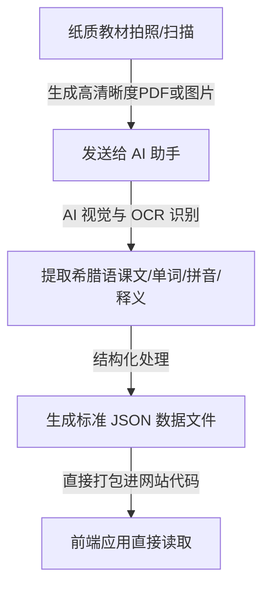

# 希腊语日常学习与复习工具规划指南

为了帮助您在雅典上小学的儿子每天高效、有趣地学习和复习希腊语，我们完全可以为您定制开发一个专用的**希腊语学习 Web 应用（网站）**。

本指南为您梳理了教材数字化、数据存储、系统架构以及具体的功能实现方案，让您了解如何从零开始操作。

---

## 1. 核心功能设计 (Core Features)

为了让孩子保持学习兴趣，我们可以将应用设计为**“闯关式”**的学习体验：

*   **📖 课前预习 (Preview)**：
    *   **课文跟读**：展示希腊语课文，并利用浏览器自带的语音合成技术（Web Speech API）进行单词和句子发音跟读（零成本、无需接入付费语音接口）。
    *   **生词速览**：高亮本课核心词汇，提供双语对照。
*   **🃏 趣味闪卡 (Flashcards)**：
    *   采用类似 Anki 的**卡片反转**效果（正面希腊语，反面中文/英文 + 图片示例）。
    *   **间隔重复算法**：根据孩子的掌握程度（“太简单”、“刚刚好”、“记不住”），智能安排单词再次出现的时间。
*   **🎮 趣味测验与闯关 (Quizzes & Levels)**：
    *   **关关设计**：按教材的单元（Unit）和课时（Lesson）设计关卡，完成一课的测验才能解锁下一课。
    *   **多样化题型**：包含**听音选词**、**单词拼写**（打字拼写对希腊语学习非常重要）、**连线匹配**、**选择题**。
    *   **即时反馈**：通关时有星星（⭐）奖励和动效，增加成就感。
*   **🔍 翻译与词典 (Translation & Dictionary)**：
    *   内置简单的单词快速搜索，或者通过集成轻量级 AI 接口，允许孩子输入句子进行希腊语/中文互译。

---

## 2. 教材数字化流程 (Content Digitisation Workflow)

由于您只有纸质教材，我们可以通过以下步骤高效地将其转为软件可以识别的数据，**您不需要手动录入大量文字**：



### 💡 您的具体操作：
1.  **拍照/扫描**：使用手机（例如使用 iPhone 自带的备忘录扫描、Scanner Pro、扫描全能王等）对课本的生词表、课文、练习页进行拍照。建议**以单页或章节为单位**导出为清晰的 PDF 或图片。
2.  **发送给 AI**：直接将 PDF/图片发送给本系统（Antigravity IDE）。
3.  **结构化提取**：我会使用多模态能力，帮您将图像中的希腊语单词、例句、语法点以及中文释义精确提取出来，整理成如下所示的结构化 `chapters.json` 数据：

```json
[
  {
    "unit": 1,
    "lesson": 1,
    "title": "Γεια σας (你好)",
    "story": {
      "greek": "Γεια σας! Με λένε Γιώργο. Εσένα;",
      "chinese": "你们好！我叫乔治。你呢？"
    },
    "vocabulary": [
      {
        "word": "Γεια σας",
        "pronunciation": "ya sas",
        "meaning": "你好 / 你们好",
        "example": "Γεια σας, κύριε Παπαδόπουλε."
      }
    ]
  }
]
```

---

## 3. 技术架构：需要存放数据的服务器吗？ (Architecture & Data Storage)

**结论：对于个人或家庭使用，完全不需要购买和维护昂贵的服务器。**

我们可以采用 **本地优先 (Local-First)** 的技术架构，既省钱又高效：

| 方案 | 数据存储方式 | 优点 | 缺点 | 适用场景 |
| :--- | :--- | :--- | :--- | :--- |
| **方案 A：纯本地存储<br>（最推荐 🌟）** | **课本数据**直接写在前端代码里；<br>**学习进度/错题本**保存在浏览器的 `localStorage` 或 `IndexedDB` 中。 | 1. **零成本**：无需买服务器和域名。<br>2. **无维护**：没有服务器宕机风险。<br>3. **极速离线使用**：没网也能正常学习。 | 数据保存在设备浏览器中，若清除浏览器缓存或更换设备，进度会丢失。 | 孩子固定使用一台 iPad 或电脑进行学习。 |
| **方案 B：云端轻量存储<br>（Firebase 方案）** | 使用谷歌的 **Firebase Firestore**（云数据库）和 **Auth**（用户登录）。 | 1. **多端同步**：在电脑上学完，iPad 上进度同步更新。<br>2. **数据云备份**：不怕清理浏览器缓存。 | 稍微增加开发和配置的复杂度。 | 孩子经常在 iPad、手机、电脑之间切换使用。 |

> [!TIP]
> **我们的建议**：我们先采用 **方案 A（纯本地存储）** 快速把网站原型做出来。如果后续觉得有跨设备同步的需求，我们可以非常轻松地无缝接入 **Firebase**（因为 Firebase 对个人用户有极其慷慨的免费额度，实际运行成本依然为 **0**）。

---

## 4. 我们可以为您搭建什么样的网站？

我们可以使用 **React + Vanilla CSS (或者 TailwindCSS)** 开发一个充满现代设计感、色彩活泼、响应式的 Web App：
1.  **高级视觉风格**：采用符合儿童审美的明亮色彩（如温暖的马卡龙色调、圆润的卡片、可爱的微交互动效），拒绝简陋粗糙的界面。
2.  **iPad/平板完美适配**：因为小孩子通常用 iPad 学习，我们会专门优化手势操作（如左右滑动卡片、点击匹配等）。
3.  **PWA 支持**：让该网站支持“安装到主屏幕”，在 iPad 上看起来就像一个原生 App，点击桌面图标即可全屏打开。

---

## 5. 接下来的具体操作步骤 (Next Steps)

如果您决定开始，我们可以按照以下步骤推进：

*   `[ ]` **步骤 1**：请您先将教材的**第一课（或者前几课）**的内容拍照发给我（可以直接发送 PDF 或图片）。
*   `[ ]` **步骤 2**：我会帮您把教材内容转换为规范的 JSON 数据。
*   `[ ]` **步骤 3**：我将在您的本地工作区创建一个 React 网页项目，并实现核心的**“闪卡”**与**“单词拼写测验”**功能原型。
*   `[ ]` **步骤 4**：我们在本地运行并预览网页，确认界面和交互效果。
*   `[ ]` **步骤 5**：逐步添加“闯关”、语音朗读和错题本功能，并为您将网站免费部署上线。
