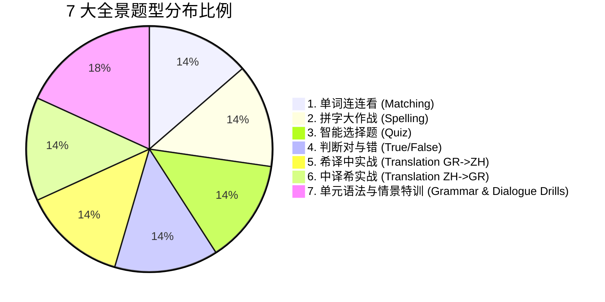

# 🏛️ Leon Greek Coach — 全景储备大题库与知识库总览 (Master Question Bank Matrix)

> **全书总题量**：**1716 道题目**  
> **单元覆盖**：全量 39 个单元（A1-A 15单元 + A1-B 15单元 + A2 9单元）  
> **单单元平均题量**：**44.0 道题**（彻底解决重复刷题与单调乏味痛点）  
> **支持题型**：7 大核心实战题型全面覆盖  
> **更新时间**：2026 年 8 月 (v2.0 权威发布)

---

## 📚 分册题库知识库导航

1. 📘 [A1 第一分册题库全书 (Units 01-15)](A1_A_Question_Bank_Units_01_15.md) — 包含 660 道题目
2. 📗 [A1 第二分册题库全书 (Units 16-30)](A1_B_Question_Bank_Units_16_30.md) — 包含 660 道题目
3. 📙 [A2 进阶分册题库全书 (Units 31-39)](A2_Question_Bank_Units_31_39.md) — 包含 396 道题目

---

## 🎯 7 种题型配比架构

## 🛡️ 质量保证机制
本题库全部 1,716 道题目已通过 Pre-Flight QA Verification 双向互检门禁，确保题干与答案 100% 一致、选择题选项位置绝对随机分布、希汉语义严密对齐。
